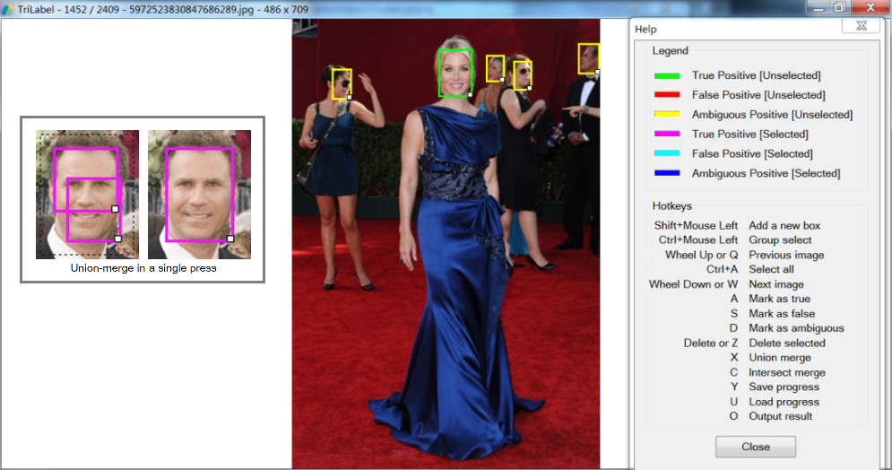

# TriLabel
(Note that this is an archive repository for a project completed in 2013)

TriLabel is a bounding box annotation tool written in C++ with Microsoft Foundation Class (MFC) Library. Algorithm outputs can be optionally loaded as a starting point for annotation. It provides a suite of keyboard shortcuts for the efficient manipulation of bounding boxes. In addition, it supports an "ambiguous" attribute for each box. Ground truth boxes that are marked as "ambiguous" can be interpreted differently during algorithm evaluation as a state in between a true positive and a false positive.

Click [here](https://youtu.be/BKvZmoC2Ves) for a demo video on YouTube.

Click [here](BinaryWithSamples.zip) for prebuilt Windows binary and samples.
